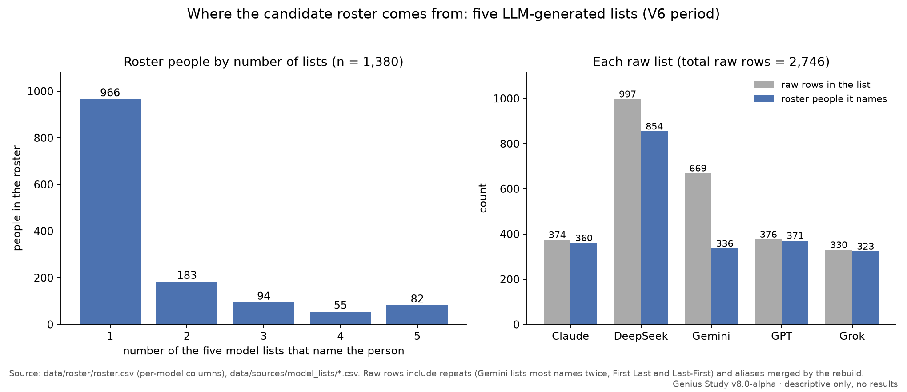
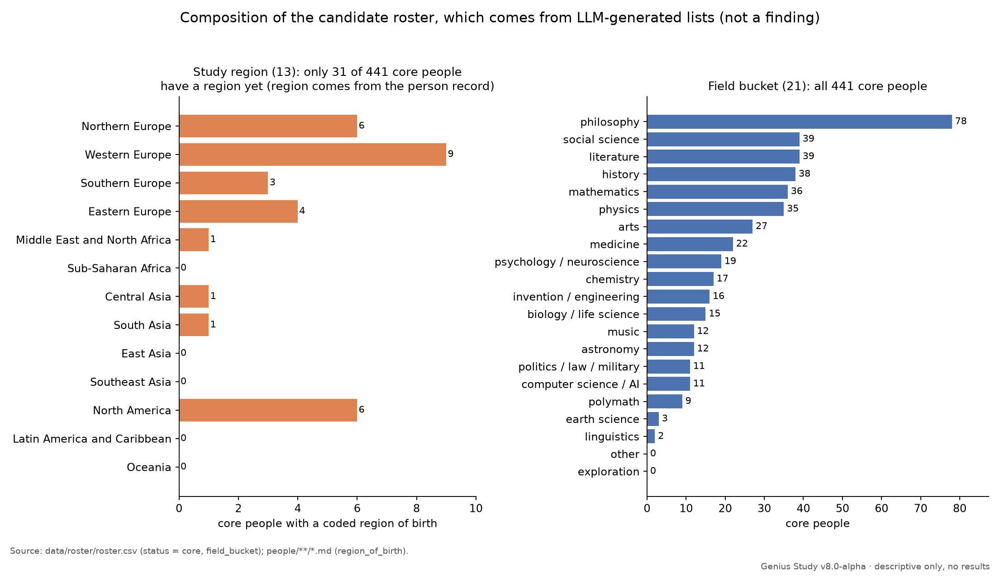
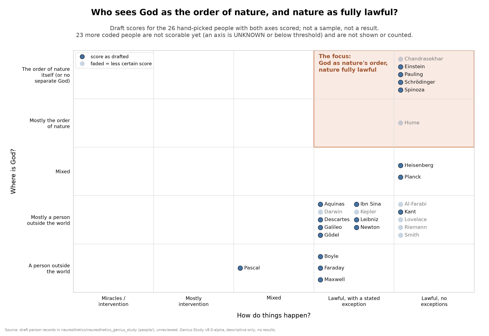
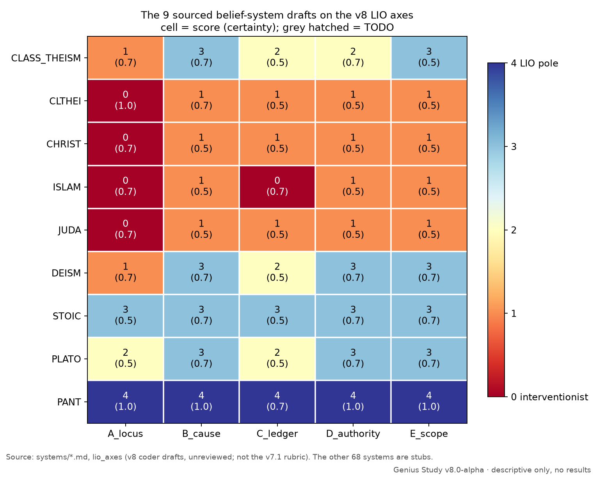

# Neuresthetics Genius Study

A study of where remembered genius sits on a scale of lawful, non-intervening order, plus a labeled belief model of how learning that order early might pay off. All versions live here. The version number is a detail, not the name.

**Current version:** v8 (in progress). The [v8.0-alpha prerelease](https://github.com/neuresthetics/neuresthetics_genius_study/releases/tag/v8.0-alpha) has the scaffolding and draft records, but no results. Until v8 is published, the latest complete release is [v7.1](https://github.com/neuresthetics/neuresthetics_v7).

**Study page:** [neuresthetics.github.io/study](https://neuresthetics.github.io/study/)

## Progress status

**There are no results yet.** Nothing here supports a frequency, rate or ranking claim.

<!-- BEGIN GENERATED: progress -->
<!-- Generated by scripts/progress_status.py; the Audits and Next steps rows are manual constants in that script. -->

| Item | Status |
|---|---|
| Roster people | 1,380: 441 core, 33 provisional, 17 review, 889 new names still need a status |
| People coded (of core) | 8 / 441 (draft, unreviewed) |
| Belief systems sourced | 9 / 77 (the rest are stubs) |
| Decisions settled | 21 / 21 |
| Audits | 3 blind lens runs on one 115-claim packet (commit eff4700); see [reports/audit_2026-10-02.md](reports/audit_2026-10-02.md) |
| Latest tag | `v8.0-alpha` (prerelease) |
| Next steps | Code more core people; fill the system stubs; the revised rubric has not started |

<!-- END GENERATED: progress -->

The table is regenerated by `python scripts/progress_status.py` and checked with `--check`. The Audits and Next steps rows are kept by hand in that script.

### Figures (v8.0-alpha, descriptive only)

These charts describe what is in the repo so far; they are not results. The roster comes from five LLM-generated lists, and the person chart shows only the six draft (unreviewed) records. Regenerate them with `python scripts/make_figures.py`.



*How many of the five LLM-generated lists name each of the 1,380 roster people (966 are on only one list), and each list's raw rows against the roster people it names.*



*Composition of the 441 core candidates by field bucket. Region of birth is coded per person record, so only the six coded people appear in the region panel. This describes the candidate roster, not a finding.*



*The six draft person records on B_cause (x) and A_locus (y), with the mid-basin zone shaded. All six are B_cause 3, and six hand-picked people are not a sample.*



*The nine sourced belief-system drafts on the five v8 LIO axes, showing each score with its certainty. These are unreviewed coder drafts, not the v7.1 rubric, and the other 68 systems are stubs.*

## What changes in v8

v8 starts by fixing the data in v7.1:

- The genius roster is rebuilt from the five original model lists, which v7.1 didn't fully use. It now has 1,380 people, up from 482.
- Frequency (F) is now the number of distinct models that list a person (1 to 5), so alias counts no longer get added together.
- Each person and each belief system gets its own record, with sources and a certainty grade for every fact.
- The two belief systems that were both labeled "Classical Theism" get separate display names (approved).
- The scales and lists that v7.1 left open (LIO axis scale, era buckets, regions, the mid-basin test) are now set. All 21 decisions are settled (19 on 2026-10-01; P6 and P7 on 2026-10-02).

See [CHANGELOG.md](CHANGELOG.md) for details.

## Repo layout

| Path | What's there |
| :--- | :--- |
| `data/sources/` | Raw inputs, read-only, with checksums: the five model lists and the v7.1 combined JSON. |
| `data/roster/` | The v8 roster (`roster.csv`), alias map, merge log, hand-curated merges, and person ids. |
| `people/` | One Markdown file per person, `people/<first letter>/<id>.md`. |
| `systems/` | One Markdown file per belief system (77), named by the v7.1 code. |
| `schema/` | JSON Schemas for person and system records. |
| `templates/` | Blank person and system records to copy. |
| `scripts/` | Roster rebuild, id assignment, validators, coverage report, data dictionary generator, figures, README progress table. |
| `docs/` | Method, data dictionary, coding guide, runbook, open decisions. |
| `reports/` | Generated reports (coverage). |
| `figures/` | Descriptive charts made by `scripts/make_figures.py` (no results). |
| `versions/` | Per-version notes and the v7.1 → v8 roster diff. |
| `papers/` | v8 papers, once written. |

## How the database grows

One person per run. Each run picks the next person, researches them from primary and scholarly sources, fills their record (leaving `TODO` where nothing is sourced yet), validates it, and commits. Belief-system records are extended the same way. Michael Faraday (`people/f/faraday-michael.md`) and Pantheism (`systems/PANT.md`) are the worked examples.

```bash
pip install -r scripts/requirements.txt
python3 scripts/rebuild_roster.py --check   # roster reproduces from the raw lists
python3 scripts/assign_ids.py --check       # person ids are up to date
python scripts/validate_people.py           # person records
python scripts/validate_systems.py          # belief-system records
python scripts/coverage_report.py           # writes reports/coverage.md
python scripts/progress_status.py --check   # README progress table is up to date
pip install -r scripts/requirements-figures.txt
python scripts/make_figures.py              # writes figures/*.png
```

## Docs

- [Method](docs/METHOD.md): how the roster, ids and records are built, and why.
- [Data dictionary](docs/DATA_DICTIONARY.md): every file, column and field.
- [Coding guide](docs/CODING_GUIDE.md): the v7.1 coding rules, certainty, worldview codes, LIO axes, and system records.
- [Runbook](docs/RUNBOOK.md): step by step for one person (or system) per run.
- [Open decisions](docs/OPEN_DECISIONS.md): choices that need sign-off and what was decided (none open as of 2026-10-02).
- [Coverage](reports/coverage.md): what exists so far.

## History

Past versions stay in their own repos so their history doesn't change.

> **Content warning: everything before V7.** V5 and V6 use methods that are now retired, including V6's ranking of religions by dividing counts of historical geniuses by 2025 religious population figures. Their results are not findings, and they compare specific faiths in ways the current study no longer does. They're kept only so the path to the current method stays visible.

| Version | Where | Notes |
| :--- | :--- | :--- |
| V5 | [V5 PDF](https://github.com/neuresthetics/neuresthetics_v7/blob/main/V6_(history)/V5/Genius%20Data%20Analysis%20V5%20(as%20dev%20history%20only).pdf) | Content warning. Dev history only. |
| V6 | [NEUR-V6-DATA](https://github.com/neuresthetics/NEUR-V6-DATA) | Content warning. Retired rate-table approach. |
| V7 / V7.1 | [neuresthetics_v7](https://github.com/neuresthetics/neuresthetics_v7) | Two-lane paper, neurology sister paper, data book, combined JSON. |

## Site

[neuresthetic.net](https://neuresthetic.net)
